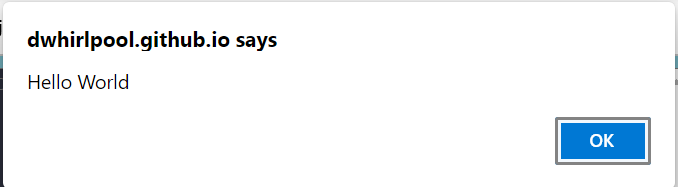

# Hello World


1. Go to your test site and create a new folder named `src`. Within the src folder, create a new text document called `app.js`, and save it.
2.  In your `index.html` file, enter this code on a new line, just before the closing `</body>` tag:

    ```
    <script src="src/main.js"></script>
    ```
3. This is doing the same job as the [`<link>`](https://developer.mozilla.org/en-US/docs/Web/HTML/Element/link) element for CSS. It applies the JavaScript to the page, so it can have an effect on the HTML (along with the CSS, and anything else on the page).
4.  Add this code to the `app.js` file:

    ```
    alert('Hello World');
    ```
5. Now, This Is What You Should See (If you are using Microsoft Edge) 🠗


